# UniTiya Manual

## 简介

UniTiya 是一个 Unity 的 3D ARPG 设计系统。它提供一个从零开始开发 ARPG 游戏的基础框架，这个框架涵盖了包括角色控制、视角控制、武器系统等 ARPG 的常见元素定义；并且对于各个元素的定义，都提供默认的可配置工具，通过序列化的方式配置其具体实现。通过 UniTiya，非程序专业的游戏策划、美术等人员可以以一种直观友好、不通过代码就能实现其各种各样的游戏设计想法；而程序人员也可以根据元素的定义进行自由地拓展，来实现更丰富的自定义功能。

## Tiya Core Protocol

Tiya Core Protocal（以下简称 TCP）是 UniTiya 运作所需要的最小核心协议，存在于命名空间 `Sarachan.UniTiya` 中。该协议定义了 UniTiya 系统中所有元素模块的接口，具体可以见文档说明。

UniTiya 对 TCP 中每个接口都实现了一个模块，且保证模块之间仅通过 TCP 进行通信。这意味着可以根据需求仅导入需要的模块，而直接忽略其他模块（TCP 的每个元素并不一定是必须的）或者根据接口实现自己的元素。

## Tiya Basic Library

对于所有模块， UniTiya 提供一个模块共用，并且也向外部开放的类库 Tiya Basic Library（以下简称 TBL）。TBL 提供各种通用的工具类，包括游戏全局设置工具、各种序列化工具（比如因为完全通过 TCP 通信，而接口不能被序列化，提供 `TypeRestriction` `PropertyAttribute` 来将接口序列化）、命令模式的原型实现等等。

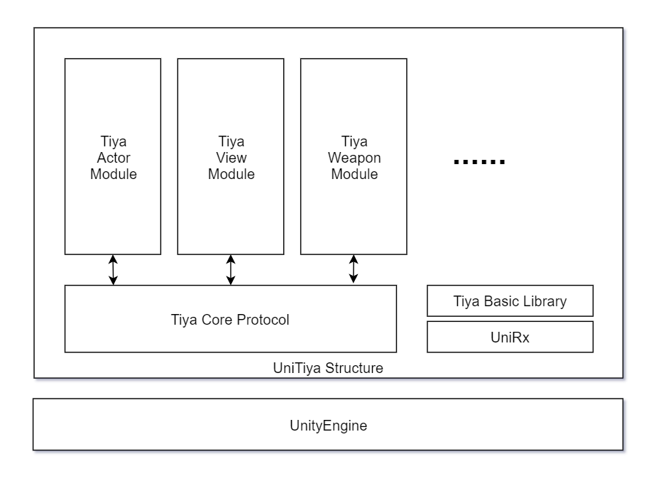

## 模块内部设计

在模块的内部，UniTiya 只实现最基础的逻辑功能，而采用观察者模式向外提供丰富的可序列化的事件回调，尽量保证行为的可拓展性。

### 模块的使用与拓展

拓展一个已有的模块可以采用继承重写某些特定的虚方法（UniTiya 中这些方法一般都是名以 `On` 开头或以 `Override` 结尾的 `protected virtual` 方法，具体请参阅文档。）（常见于 `ScriptableObject` 的行为的自定义）；或者是通过组件模式，在另一个组件中实现逻辑并配置其 event（常用于 `Monobehaviour` 的行为的自定义）；或是通过序列化的方式，配置其序列化的事件字段（UniTiya 提供一个可序列化的 Listener 库用于配置事件，该库包含了非常多的常见行为，比如恢复 HP、生成伤害区域、使用物品等）。

### 行为的执行

#### (1) Actions

Actions 代表一类对象向外提供的所有可能的行为方法接口，以下都以 `TiyaActor` 模块为例。该模块的 `IActorActions` 接口定义了 Actor 的 `Move`、`Jump` 等方法。

在 TBL 中提供了一种 Action 的实现方法 `Skill`，对于每一个行为接口中的行为，都可以委托给一个 skill 的 `TryToPerform` 和 `Cancel` 执行。

Skill 代表一种有执行条件的瞬时或持续行为，只有满足条件时 Skill 才会 Perform。`TiyaSkill` 可以根据需要配置 Consumer（Consumer 是对可消耗代价的抽象，在 TBL 中提供了如冷却事件、数值、物品等的 Consumer，也可以通过实现 `IConsumer` 定义自己的 Consumer），并且大多数 Consumer 都可以通过序列化配置，以此来控制 Skill 执行的条件。

#### (2) Controller

Controller 代表一类对象的实体，是模块对外的最主要接口，它是该对象的属性以及其的所有可能的行为的集合，比如 `ActorController`，其中有着关于 Actor 的诸如 `GameObject`、`Speed` 值类的各种属性，也有一个 `IActorActions` 实例（以下称为 `ActorActions`）代表 Controller 的所有行为。

直接操作 Controller 代表着 **无条件** 执行对应的行为（这样的操作一般是属性操作，Controller 一般也会有一个 `DefaultActions` 的 `IActorActions` 默认的行为属性，`ActorActions` 默认就是 `DefaultActions`）。Controller 还提供一个可选的序列化的 **行为接口重写**，行为接口重写实现了同样的行为接口。如果 Controller 设置了行为接口重写，则 Controller 会调用重写中的对应方法而不是直接调用无条件行为方法。

#### (3) 逻辑行为重载

重载通过实现行为接口，然后将该接口实例提供给 Controller 的序列化字段实现（也有些 Controller 可能会自动寻找是否有重载）。而最常见的重载方式便是 **状态机**。

在 TBL 中提供了一个通用的可配置状态机实现 `Sarachan.UniTiya.StateMachine`，可以很方便地配置自己的状态机（关于状态机的具体使用方法请参见文档）。Actor 模块中也提供了一个默认的状态机 `TiyaActorStateMachine` 提供基础的 Actor 行为重载。

#### (4) 决策系统

Controller 中都提供一个命令处理器的接口来执行决策（但也可以不使用命令模式直接执行方法）。BCL 中提供一个命令模式系统 `Sarachan.UniTiya.Commands`，并且提供了各个模块所需要的通用命令。

用户的决策（即输入系统）采用 `UnityEngine.InputSystem`，UniTiya 对各个行为都提供了 `InputAction` 与其适配。而对于 AI 决策，也可以使用状态机或 **行为树** 进行决策，BCL 中也提供了一个可配置的行为树实现 `Sarachan.UniTiya.BehaviourTree`。

#### 行为执行总结

综上，一个行为调用的流程即：

InputAction 触发或 AI 决策 => 生成对应命令并添加到 Controller 命令处理器接口 => 命令队列执行命令 => Controller 无行为重载，则直接执行行为，否则委托给行为重载执行行为。

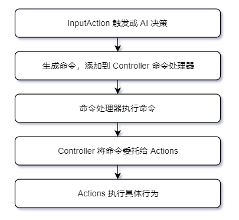

## 模块介绍

### Tiya Actor

Actor 代表所有具有能动性的游戏对象，比如玩家、NPC、怪物等。Tiya Actor 实现了其如移动、跳跃、攻击等等基础逻辑。

`TiyaActorController` 实现了 `IActorController`，除此之外提供两种移动方式（Free Move 与 Strafe Move），以及更换 Actor 模型的方法。

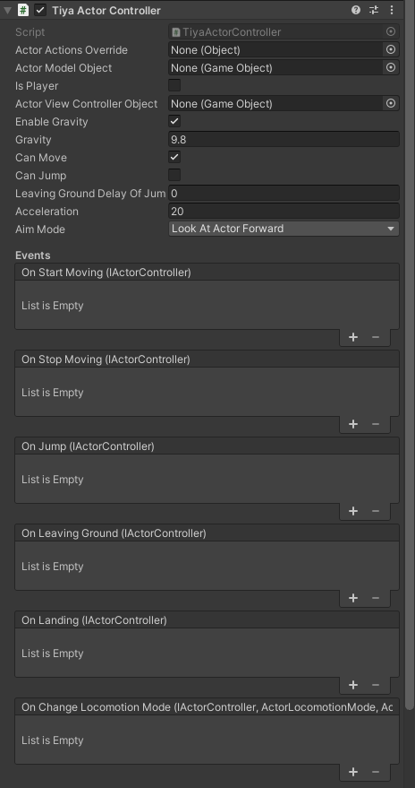

`TiyaActorProperties` 实现了 `IActorProperties`，为 `IActorController` 提供属性配置。

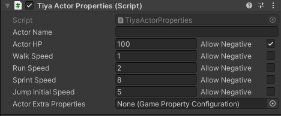

`TiyaActorEquipmentManager` 实现了 `IEquipmentManager`，为 Actor 提供装备武器、装备的功能。

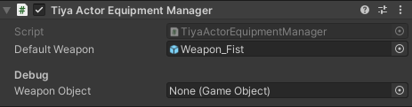

`TiyaStateMachine` 实现了一个可配置的基础 Actor 状态机，作为 Actor 的逻辑行为重载使用。

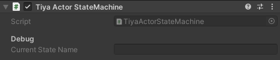

额外工具：Cloth Tool。Cloth Tool 可以将指定的服装附加到当前 Actor 身上，并且自动处理其骨骼关系与物理模拟（物理模拟需要插件 `Dynamic Bone`，配置方法见文档）。

`TiyaClothChanger` 与 `TiyaActorModelInfo` 可以将任一具有 `TiyaClothInfo` 的组件 `GameObject` 装备在 Actor 身上。

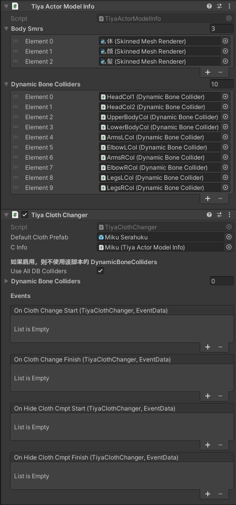

### Tiya View

View 代表一个 Actor 的视线，它控制 Actor 的索敌功能。而对于 Player 的 View，它还额外提供了对 Camera 的控制功能。

`TiyaActorView` 实现了 `IActorView`，它适用于非玩家的 View。

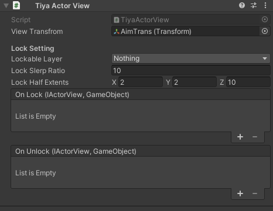

`TiyaActorCameraView` 实现了 `IActorCameraView`，它适用于玩家的 View，并提供对 Camera 的各种操作方法。它通过读取配置文件进行 Camera 的如视距等的详细设置；支持第一人称、第三人称视角，也支持人物/场景分离渲染等功能。

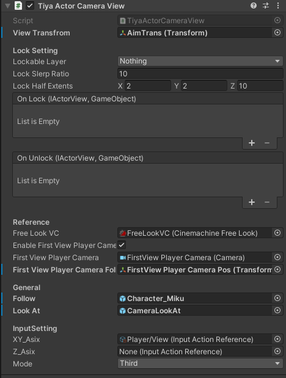

### Tiya Weapon

在 UniTiya 中，`IWeaponController` 承担了所有攻击的逻辑。

`TiyaWeaponController` 实现了 `IWeaponController`，通过配置 `Skill` 的方式配置武器的具体行为。

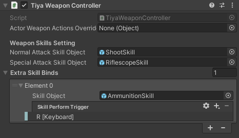

并且，提供几种通用的可配置武器 Skill 实现：

基于动画事件的近战 Skill `WeaponAnimatedMeleeSkill`：

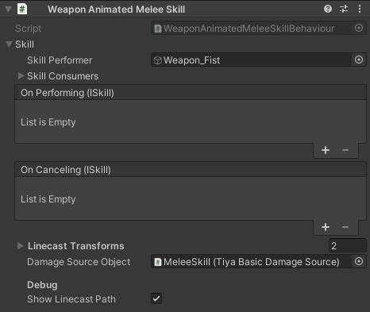

基于伤害区域的近战 Skill `WeaponDamageFieldMeleeSkill`：

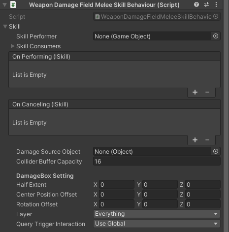

基于投掷物的远距离攻击 Skill `WeaponProjectileSkill`：

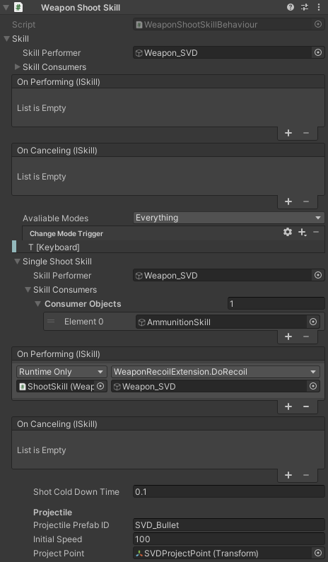

### Item System

UniTiya 的物品、背包系统，并提供物品的通用功能 Listener 来配置物品功能。

`TiyaItem` 实现了 `IItem`，代表一个物品。

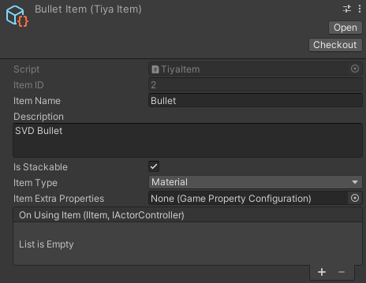

`TiyaItemManager` 实现了 `IItemManager`，代表物品的全局注册器。他会为注册在其中的 `IItem` 自动分配 ID，并根据 Item Type 自动管理所有 Item。

`TiyaInventory` 实现了 `IInventory`，代表一个背包。他提供添加物品、获取物品、丢弃物品等方法。

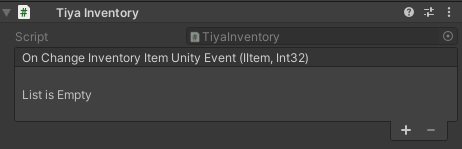

### Interaction

Interaction 是 UniTiya 的交互模块。

`TiyaInteractive` 实现了 `IInteractive`，代表一个可交互对象。它需要在一个 Trigger 上才会生效，在 `IInteractiveObjectHandler` 进出 Trigger 时将该交互对象注册到交互主体。

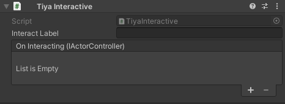

`TiyaInteractiveObjectHandler` 实现了 `IInteractiveObjectHandler`，代表一个 Actor 交互主体。它内部维护一个可交互对象列表，可以使 Actor 与当前选中的交互对象交互，或者迭代选中的交互对象。

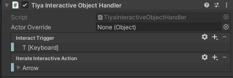

### Damage Interaction

Damage Interaction 是 UniTiya 的战斗伤害模块。它通过配置伤害值与伤害事件，执行伤害交互逻辑。

`TiyaDamageable` 实现了 `IDamageable`，代表空的可配置接受伤害的对象：

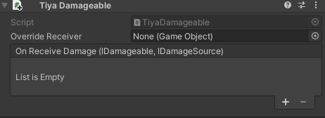

`TiyaActorDamageable` 继承于 `TiyaDamageable`，会根据伤害源减少 Actor HP。

`TiyaDamageSource` 实现了 `IDamageSource`，代表可配置的伤害源。`IDamageSource` 有拓展方法 `DoDamageTo` 来尝试对目标对象造成伤害。

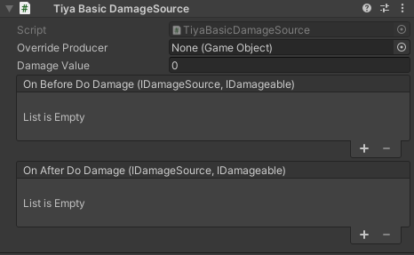

### Tiya Animator

Tiya Animator 在 UniTiya 中属于一个可选的插件类型，它提供一个必须的 Animator Controller 资源，使用该 Animator Controller 的 Animator 都可以使用 Tiya Animator 模块提供的工具来进行动画的维护与配置。

工具类 `TiyaAnimatorTools` 提供了 Animator Controller 资源的包括状态、层等各种信息以及层切换等辅助方法。

对于 `Actor`，Tiya Animator 提供一个 `IActorTiyaAnimator` 接口处理基础的动画变换。 `ActorTiyaAnimatorAdapter` 组件实现了这个接口。对于 AnimationClip 的重载建议直接使用 Animator Override Controller 资源。

对于 `Weapon`，Tiya Animator 提供一个 `IWeaponTiyaAnimatorAdapter` 来为武器的每一种动作提供运行时的  AnimationClip 重载。Tiya Animator 实现了 `TiyaWeaponTiyaAnimatorAdapter` 来提供动画重载以及基础的动画处理。

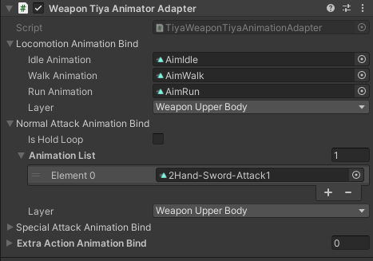

### Tiya Game Properties

Tiya Game Properties 使用于设置、获取游戏属性的工具。由于游戏属性根据游戏不同存在极大的差别和自由性，UniTiya 提供一套自由的属性配置器来通过序列化的方式定义属性。对于一些通用的属性，UniTiya 也对这些提供了额外的属性接口（比如 Actor 属性 `IActorProperties`）。

基础的属性接口为 `IGameProperties`，UniTiya 实现了 `GamePropertyConfiguration` 的 `ScriptableObject` 用于序列化属性配置，也实现了 `RuntimePropertyConfiguration` 用于基础运行时属性配置。

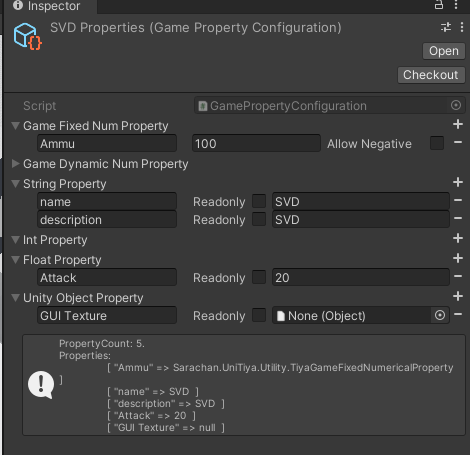

并且，UniTiya 还提供 `PropertyValueSynchonizer` 工具通过配置同步属性值。
